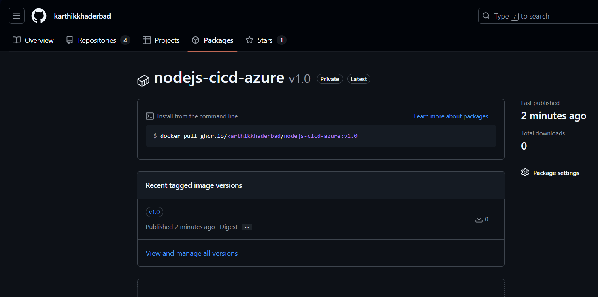

Creating a Docker registry in Github:  
Create a github pat with the following permissions  
 
docker login ghcr.io -u karthikkhaderbad -p YOUR_PERSONAL_ACCESS_TOKEN  
docker build -t ghcr.io/karthikkhaderbad/nodejs-cicd-azure:v1.0 .  
docker push ghcr.io/karthikkhaderbad/nodejs-cicd-azure:v1.0  
now if I go to github .. packages I see  
 